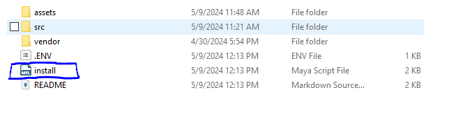

# How To Use

## Playblast Tool

    

* This tool is made to make it eaiser to create a playblast with a set format.
    1. This format includes these settings;
        

* First thing you'll need to do is add the tool to your maya file. 
    1. All you need to do is drag the "install" maya file into your active viewport in maya and the Shelf button should pop up.
    

        
    

    2. This is what the Shelf Button will look like;
    

        
    

* Next, you'll need to name your playblast in the "Name:" option
* Then, you need to choose the folder you'll be saving your playblast to. To do this, you need to click the "..." button and the directory you choose will show up in the "Save Directory:" Box.
* And That's It! All you need to do is press the "Playblast Current Window" Button and your animation will playblast your current window with the settings shown above! 

### Why did I make this tool?

* I have often struggled with accidentally playblasting and it can get tedius choosing the settings every time.

* By creating a playblast shelf button with the settings already set, I get rid of the tedius step and have a less chance to playblast accidentally. 

* On top of that, it's just easier to see and access. 